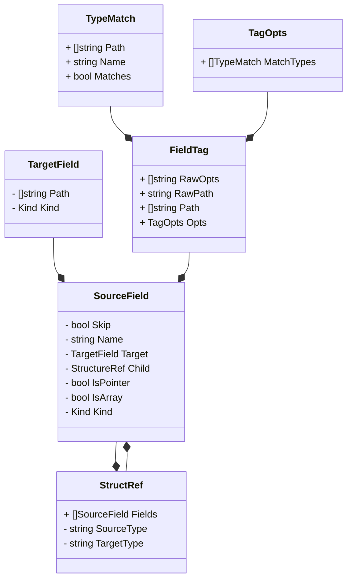

```go
// TODO: clean this
generated, _ := json.Marshal(localRepresentations)
fmt.Printf("start: %s \n end \n", generated)

foreigns, _ := json.Marshal(foreignRepresentations)
fmt.Printf("start: %s \n end \n", foreigns)
```


